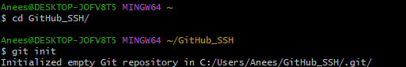
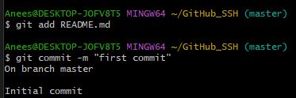
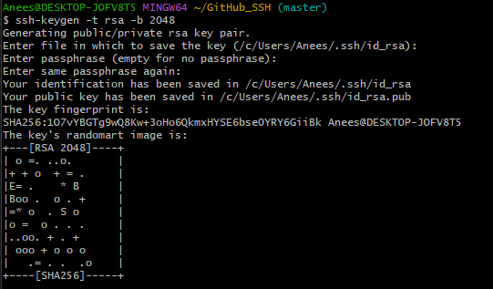
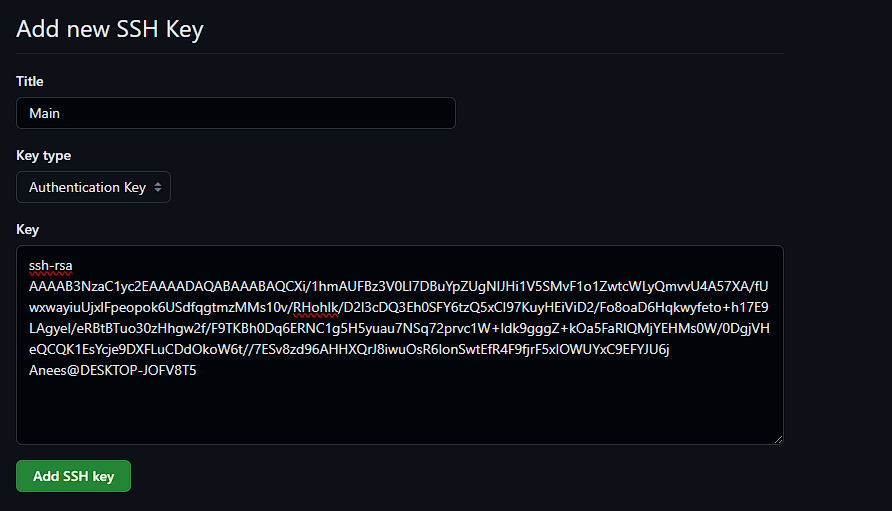
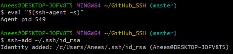
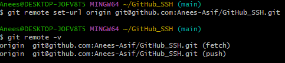

1. Go to the directory you want, and init it as a repo

    

2. Add all files you want uploaded to staging area and then commit

    
3.  Generate the private and public keys used for auth

    
4. Give your SSH key a title and paste your public key into the "Key" field. Click the "Add SSH key" button to add the key to your GitHub account.

    
5. Add your SSH key to SSH agent. This will help with the authentication

    

6. Update the Git Remote URL and Use `git remote -v` to ensure that you're connected via SSH
 
    

7. Push to github!

